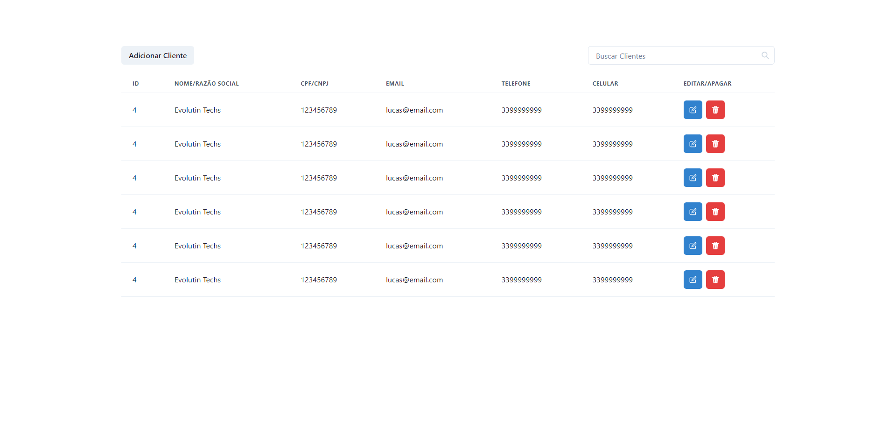

  <a href="#techs"> Tecnologias </a>&nbsp;&nbsp;&nbsp;|&nbsp;&nbsp;&nbsp;
  <a href="#run"> Como usar </a>&nbsp;&nbsp;&nbsp;

  

  

## Techs ​⚙ ​<a name="techs" />

- React
- Typescript
- Chakra UI
- API Mock (Json Server)

... Entre outros

## Instalação e execução ​ℹ️ ​<a name="run" />

1. Rode `yarn` ou `npm install` para instalar as dependências;
2. Rode `yarn dev` ou `npm run dev`;
3. Em outro terminal rode `yarn start:json-server` para rodar sua api mock
